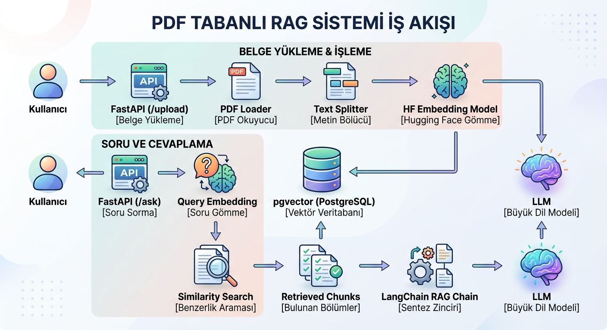
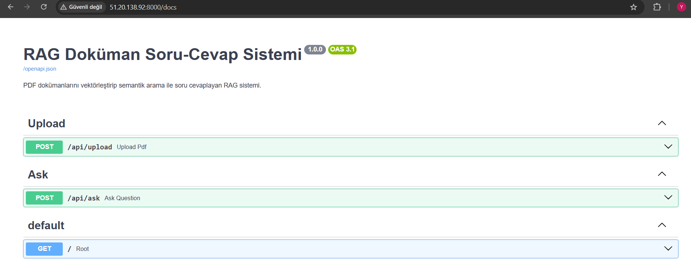
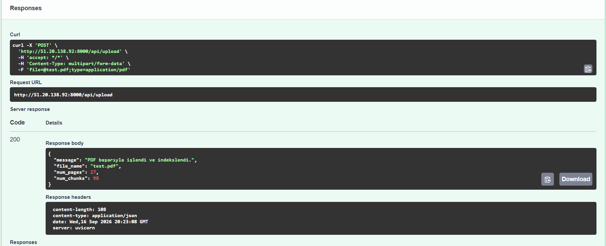

# RAG Tabanlı Doküman Soru-Cevap Sistemi

PDF dokümanlarını işleyerek içeriklerini vektör veritabanında indeksleyen ve kullanıcı sorularını doküman içeriğine dayanarak yanıtlayan uçtan uca bir **Retrieval-Augmented Generation (RAG)** uygulamasıdır.

Sistem; PDF → metin çıkarma → chunking → embedding → pgvector ile vektör arama → ilgili içeriklerin retrieval işlemi → LLM ile cevap üretme adımlarından oluşur.

Uygulama **FastAPI**, **PostgreSQL + pgvector**, **Hugging Face**, **LangChain** ve **Docker** kullanılarak geliştirilmiş ve **AWS EC2** üzerinde deploy edilmiştir.

---

## 📸 Proje Görselleri

### RAG Mimarisi



### Swagger UI



### RAG Soru-Cevap



---

## Özellikler

* PDF dokümanlarından metin çıkarma
* Sayfa bazlı PDF işleme
* Metinleri overlap destekli anlamlı chunk'lara ayırma
* Hugging Face `sentence-transformers/all-MiniLM-L6-v2` ile embedding üretimi
* 384 boyutlu embedding kullanımı
* PostgreSQL + pgvector ile vektör saklama
* Cosine similarity tabanlı semantic search
* İlgili doküman parçalarının retrieval edilmesi
* Hugging Face Inference Providers üzerinden Groq ile LLM kullanımı
* `openai/gpt-oss-20b` ile cevap üretimi
* Cevaplarla birlikte kaynak PDF ve sayfa bilgilerinin döndürülmesi
* FastAPI REST API
* Swagger UI ile API test edebilme
* Docker ve Docker Compose ile containerization
* PostgreSQL healthcheck ve servis bağımlılığı yönetimi
* AWS EC2 üzerinde deployment
* GitHub üzerinden source code yönetimi

---

# Mimari

## RAG Pipeline

```text
                    PDF Upload
                        │
                        ▼
                  FastAPI API
                        │
                        ▼
                   PDF Loader
                        │
                        ▼
                  Text Chunking
                        │
                        ▼
              Hugging Face Embedding
             all-MiniLM-L6-v2
                        │
                        ▼
             PostgreSQL + pgvector
                        │
                        │
        ┌───────────────┘
        │
        │ User Question
        ▼
     FastAPI /ask
        │
        ▼
   Query Embedding
        │
        ▼
  Vector Similarity Search
        │
        ▼
  Relevant Document Chunks
        │
        ▼
     RAG Chain
        │
        ▼
 Hugging Face Inference
       Groq
        │
        ▼
 openai/gpt-oss-20b
        │
        ▼
      Answer
        │
        ▼
 Source PDF + Page Numbers
```

---

# Teknoloji Stack'i

| Katman              | Teknoloji                                             |
| ------------------- | ----------------------------------------------------- |
| Backend             | Python, FastAPI                                       |
| RAG / Orchestration | LangChain                                             |
| Embedding           | Hugging Face `sentence-transformers/all-MiniLM-L6-v2` |
| Embedding Dimension | 384                                                   |
| LLM Provider        | Hugging Face Inference Providers                      |
| LLM Backend         | Groq                                                  |
| LLM Model           | `openai/gpt-oss-20b`                                  |
| Vector Database     | PostgreSQL + pgvector                                 |
| Containerization    | Docker                                                |
| Orchestration       | Docker Compose                                        |
| Cloud               | AWS EC2                                               |
| Operating System    | Ubuntu 24.04 LTS                                      |
| Version Control     | Git / GitHub                                          |
| Project Management  | GitHub Projects / Scrum                               |

---


## 2. Chunking

Çıkarılan metin daha küçük parçalara ayrılır.

Chunk'lar arasında overlap kullanılarak bir parçanın sonunda bulunan önemli bilgilerin bir sonraki parçaya da taşınması sağlanır.

```text
Document
    ↓
Text
    ↓
Chunks
    ↓
Chunk 1
Chunk 2
Chunk 3
...
```

---

## 3. Embedding

Her chunk, Hugging Face üzerinde bulunan:

```text
sentence-transformers/all-MiniLM-L6-v2
```

modeli ile sayısal bir vektöre dönüştürülür.

Bu model ile:

```text
384-dimensional embedding
```

üretilir.

Örneğin:

```text
"Private key nedir?"
          ↓
    Embedding Vector
          ↓
[0.12, -0.04, 0.81, ...]
```

---

## 4. PostgreSQL + pgvector

Üretilen embedding'ler PostgreSQL veritabanında `pgvector` extension'ı kullanılarak saklanır.

Bu sayede yalnızca kelime eşleşmesine değil, **anlamsal benzerliğe** dayalı arama yapılabilir.

Örneğin:

```text
Soru:
"Private key ne işe yarar?"

        ↓

Semantic Search

        ↓

Benzer içerik:
"Private key yalnızca sahibinin bildiği
gizli anahtardır..."
```

---

# Soru-Cevap Pipeline

Kullanıcı `/ask` endpoint'ine soru gönderdiğinde:

```text
Question
   ↓
Query Embedding
   ↓
pgvector Similarity Search
   ↓
Top-K Relevant Chunks
   ↓
Context
   ↓
LLM
   ↓
Answer + Sources
```

şeklinde bir pipeline çalışır.

LLM'e doğrudan tüm PDF gönderilmez. Öncelikle kullanıcının sorusuyla semantik olarak ilişkili doküman parçaları bulunur ve bu parçalar cevap üretimi için context olarak kullanılır.

---

# API Kullanımı

## PDF Yükleme

### Endpoint

```text
POST /api/upload
```

### Content-Type

```text
multipart/form-data
```

### Request

```text
file: <pdf dosyası>
```

### Örnek Response

```json
{
  "message": "PDF başarıyla işlendi ve indekslendi.",
  "file_name": "test.pdf",
  "num_pages": 27,
  "num_chunks": 98
}
```

---

# Soru Sorma

### Endpoint

```text
POST /api/ask
```

### Request

```json
{
  "question": "Private key nedir?",
  "top_k": 5
}
```

### Örnek Response

```json
{
  "answer": "Private key, yalnızca sahibinin bildiği gizli bir anahtardır...",
  "sources": [
    {
      "source_file": "test.pdf",
      "page": 2
    },
    {
      "source_file": "test.pdf",
      "page": 5
    }
  ]
}
```

---

# Lokal Kurulum

## Gereksinimler

Projeyi lokal olarak çalıştırmak için:

* Python 3.11+
* Docker
* Docker Compose
* Git
* Hugging Face API Token

gereklidir.

---

## 1. Repository'yi Clone Et

```bash
git clone https://github.com/yagmurraydar/rag-doc-qa.git
cd rag-doc-qa
```

---

## 2. Virtual Environment Oluştur

### Linux / macOS

```bash
python3 -m venv venv
source venv/bin/activate
```

### Windows

```powershell
python -m venv venv
venv\Scripts\activate
```

---

## 3. Python Bağımlılıklarını Kur

```bash
pip install -r requirements.txt
```

---

# Environment Variables

`.env.example` dosyasını `.env` olarak kopyalayın.

Örnek:

```env
HF_API_TOKEN=hf_xxxxxxxxxxxxx

DB_HOST=localhost
DB_PORT=5432
DB_NAME=ragdb
DB_USER=postgres
DB_PASSWORD=postgres
```


---

# Docker ile Çalıştırma

Projede PostgreSQL + pgvector ve FastAPI uygulaması Docker Compose ile birlikte çalıştırılabilir.

```bash
docker compose --env-file .env -f docker/docker-compose.yml up --build -d
```

Container'ları kontrol etmek için:

```bash
docker compose --env-file .env -f docker/docker-compose.yml ps
```

Beklenen yapı:

```text
rag_app
rag_postgres
```

PostgreSQL container'ı healthcheck ile kontrol edilir ve FastAPI container'ı PostgreSQL hazır olduktan sonra başlatılır.

---

# Docker Architecture

```text
Docker Compose
│
├── rag_app
│   ├── FastAPI
│   ├── LangChain
│   ├── Hugging Face
│   └── RAG Pipeline
│
└── rag_postgres
    ├── PostgreSQL
    └── pgvector
```

Docker network içerisinde FastAPI, PostgreSQL'e `localhost` üzerinden değil servis adı üzerinden bağlanır:

```text
DB_HOST=postgres
```

Çünkü Docker Compose içerisindeki `postgres` servis adı container'lar arası DNS olarak kullanılabilir.

---

# Dockerfile

Uygulama Python 3.11 slim image kullanılarak oluşturulur.

```dockerfile
FROM python:3.11-slim

WORKDIR /app

RUN apt-get update && apt-get install -y \
    gcc \
    libpq-dev \
    && rm -rf /var/lib/apt/lists/*

# CPU-only PyTorch
RUN pip install --no-cache-dir \
    torch \
    --index-url https://download.pytorch.org/whl/cpu

COPY requirements.txt .
RUN pip install --no-cache-dir -r requirements.txt

COPY . .

EXPOSE 8000

CMD ["uvicorn", "app.main:app", "--host", "0.0.0.0", "--port", "8000"]
```

## Neden CPU-only PyTorch?

AWS EC2 instance üzerinde GPU bulunmadığından CUDA/NVIDIA bağımlılıklarının kurulmasına gerek yoktur.

Standart PyTorch kurulumu Docker image'ının gereksiz şekilde büyümesine ve EC2 disk alanının tükenmesine neden olabildi.

Bu nedenle CPU-only PyTorch kullanıldı:

```text
CPU-only PyTorch
        ↓
Daha az gereksiz bağımlılık
        ↓
Daha küçük deployment footprint
        ↓
EC2 üzerinde daha uygun kullanım
```

---

# AWS EC2 Deployment

Uygulama AWS EC2 üzerinde Docker Compose kullanılarak deploy edilmiştir.

## AWS Ortamı

```text
Cloud Provider : AWS
Service        : EC2
Region         : eu-north-1
Instance       : t3.micro
OS             : Ubuntu 24.04 LTS
```

> Instance tipi ve işletim sistemi, deployment sırasında AWS Console'da kullanılabilir seçeneklere göre belirlenmiştir.

---

## Deployment Mimarisi

```text
                         Internet
                            │
                            ▼
                    AWS Security Group
                         TCP : 8000
                            │
                            ▼
                     AWS EC2 Instance
                    Ubuntu 24.04 LTS
                            │
                     Docker Compose
                            │
             ┌──────────────┴──────────────┐
             │                             │
             ▼                             ▼
        FastAPI App                  PostgreSQL
         rag_app                    + pgvector
             │                             │
             └──────────────┬──────────────┘
                            │
                            ▼
                       RAG System
```

---

# EC2 Deployment Adımları

## 1. EC2'ye SSH ile Bağlanma

Örneğin:

```bash
ssh -i "rag-doc-qa-key.pem" ubuntu@<EC2-PUBLIC-DNS>
```

---

## 2. Repository'yi Clone Etme

```bash
git clone https://github.com/yagmurraydar/rag-doc-qa.git
cd rag-doc-qa
```

---

## 3. Environment Variables

EC2 üzerinde `.env` dosyası oluşturuldu ve Hugging Face token gibi gizli bilgiler burada tutuldu.


---

## 4. Docker Compose ile Deploy

```bash
docker compose --env-file .env -f docker/docker-compose.yml up --build -d
```

Container durumları:

```bash
docker compose --env-file .env -f docker/docker-compose.yml ps
```

Logları kontrol etmek için:

```bash
docker logs rag_app --tail 100
```

---

# EC2 Disk Problemi

Deployment sırasında Docker image oluşturulurken:

```text
no space left on device
```

hatası alındı.

Bunun temel nedeni AI bağımlılıklarının ve Docker build cache'inin EC2'nin başlangıçtaki disk alanını tüketmesiydi.

Öncelikle Docker build cache temizlendi:

```bash
docker builder prune -f
```

Daha sonra EC2'nin EBS disk alanı:

```text
8 GB → 20 GB
```

olarak artırıldı.

Linux partition ve filesystem de genişletildi:

```bash
sudo growpart /dev/nvme0n1 1
```

```bash
sudo resize2fs /dev/nvme0n1p1
```

Disk durumu:

```bash
df -h /
```

ile kontrol edildi.

Bu işlemlerden sonra Docker image başarıyla oluşturuldu.

---

# AWS Security Group

API'ye dışarıdan erişebilmek için Security Group üzerinde gerekli portlar açıldı.

```text
Port 22
→ SSH bağlantısı

Port 8000
→ FastAPI API
```

PostgreSQL'in `5432` portu dışarıya API erişimi için açılmadı; PostgreSQL Docker ağı içerisinde uygulama tarafından kullanıldı.

---

# Swagger UI

Deployment sonrasında API'nin çalıştığını doğrulamak için Swagger UI kullanıldı.

### Lokal

```text
http://localhost:8000/docs
```

### AWS

```text
http://<EC2-PUBLIC-IP>:8000/docs
```

Swagger üzerinden:

* PDF upload
* Document indexing
* Question asking
* RAG response

işlemleri test edildi.


---

# RAG Soru-Cevap Sonucu

Swagger UI üzerinden `/api/ask` endpoint'i kullanılarak kullanıcı sorusu gönderildiğinde sistem ilgili doküman parçalarını retrieve ederek LLM ile cevap üretir.

Cevap ile birlikte ilgili PDF ve sayfa bilgileri de döndürülür.


---

# GitHub SSH Authentication

AWS EC2 üzerinde GitHub'a push yapılırken HTTPS authentication hatası alındı:

```text
Password authentication is not supported for Git operations.
```

GitHub'ın normal hesap şifresiyle HTTPS üzerinden Git authentication'ı desteklememesi nedeniyle EC2 üzerinde SSH authentication yapılandırıldı.

SSH key oluşturuldu:

```bash
ssh-keygen -t ed25519 -C "yagmurraydar"
```

GitHub'a public key eklendikten sonra bağlantı:

```bash
ssh -T git@github.com
```

ile test edildi.

Başarılı authentication sonrasında repository remote adresi SSH olarak değiştirildi:

```bash
git remote set-url origin git@github.com:yagmurraydar/rag-doc-qa.git
```

Kontrol:

```bash
git remote -v
```

Sonrasında:

```bash
git push origin main
```

başarıyla gerçekleştirildi.

---

# Git Workflow

Projede Git ve GitHub kullanılmıştır.

Temel workflow:

```text
Local Development
       ↓
Git Commit
       ↓
GitHub
       ↓
AWS EC2
       ↓
Docker Deployment
```

GitHub repository:

`https://github.com/yagmurraydar/rag-doc-qa`

---

# Proje Yönetimi

Proje geliştirme sürecinde sprint bazlı çalışma ve GitHub Projects kullanılmıştır.

Issues, User Story formatında oluşturularak geliştirme adımları parçalara ayrılmıştır.

Örnek workflow:

```text
Backlog
   ↓
Sprint Backlog
   ↓
In Progress
   ↓
Review
   ↓
Done
```

---

# Karşılaşılan Problemler ve Çözümler

## 1. Docker Disk Alanı Problemi

**Problem:**

```text
no space left on device
```

**Çözüm:**

* Docker build cache temizlendi.
* EC2 EBS disk alanı artırıldı.
* Linux partition genişletildi.
* Filesystem genişletildi.
* CPU-only PyTorch kullanıldı.

---

## 2. Docker Container'lar Arası Database Connection

**Problem:**

Container içerisinden PostgreSQL'e `localhost` ile bağlanmaya çalışmak.

**Çözüm:**

Docker Compose servis adı kullanıldı:

```env
DB_HOST=postgres
```

---

## 3. GitHub Authentication

**Problem:**

```text
Password authentication is not supported
```

**Çözüm:**

EC2 üzerinde SSH key oluşturuldu ve GitHub repository SSH remote'una geçirildi.

---

## 4. PostgreSQL Başlamadan API'nin Başlaması

**Problem:**

FastAPI uygulamasının PostgreSQL hazır olmadan başlaması.

**Çözüm:**

PostgreSQL için Docker healthcheck tanımlandı ve FastAPI servisinde:

```yaml
depends_on:
  postgres:
    condition: service_healthy
```

kullanıldı.

---

# Öğrenilenler

Bu proje sırasında aşağıdaki konularda uygulamalı deneyim kazanılmıştır:

* RAG mimarisi
* PDF processing
* Text chunking
* Embedding generation
* Semantic search
* PostgreSQL
* pgvector
* LangChain
* Hugging Face
* LLM integration
* FastAPI
* REST API
* Swagger UI
* Docker
* Docker Compose
* Docker networking
* Docker volumes
* Healthcheck
* Linux / Ubuntu
* SSH
* Git / GitHub
* AWS EC2
* AWS Security Groups
* EBS disk management
* Cloud deployment
* Environment variables ve secret management

---

# Sonuç

RAG-Doc-QA projesi, PDF dokümanlarını işleyerek vektör tabanlı semantic search gerçekleştiren ve ilgili içerikleri LLM'e context olarak sağlayarak cevap üreten uçtan uca bir RAG sistemidir.

Proje lokal ortamda Docker Compose ile çalıştırılabilmekte ve AWS EC2 üzerinde containerized şekilde deploy edilebilmektedir.

Temel mimari:

```text
PDF
 ↓
Text Extraction
 ↓
Chunking
 ↓
Embedding
 ↓
PostgreSQL + pgvector
 ↓
Semantic Retrieval
 ↓
Relevant Context
 ↓
LLM
 ↓
Answer + Sources
```

---

## Repository

GitHub:

`https://github.com/yagmurraydar/rag-doc-qa`
